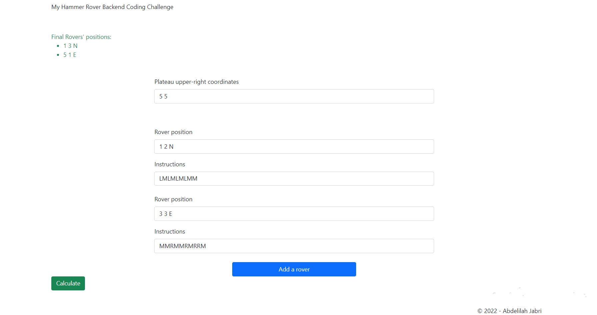
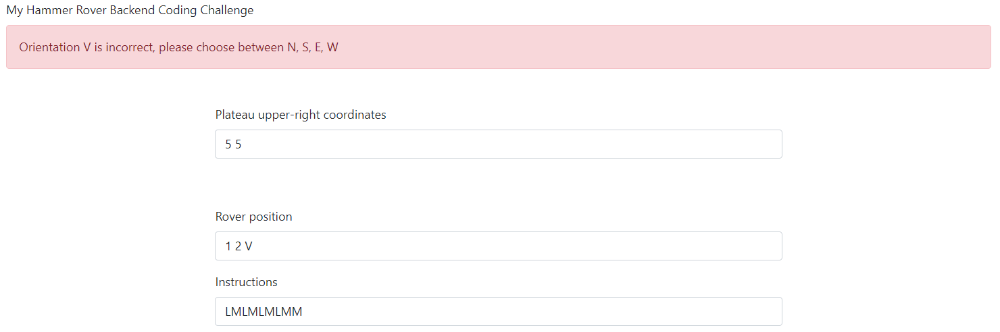
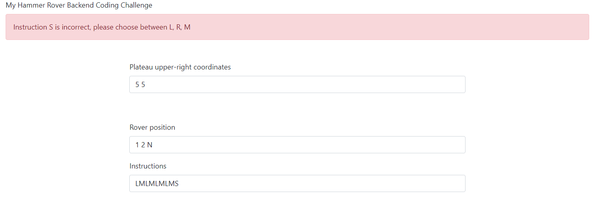
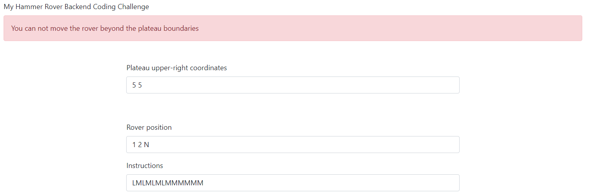
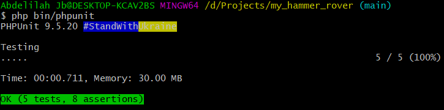

# My Hammer Rover Backend Coding Challenge

## Tech stack

Symfony 5.4

PHP 7.4

Twig 3.0

PHPUnit 9.5

Composer 2.0 

## Install & Run

Requirements: Symfony CLI, PHP >= 7.4

Clone the repository.

`composer install`

`symfony server:start`

Visit your localhost: `http://127.0.0.1:8000/`

#### Run tests:
`php bin/phpunit`

## Screenshots

##### Calculate the given inputs:

##### Incorrect orientation

##### Incorrect instruction

##### Rover reach plateau limit

##### PHPUnit tests

